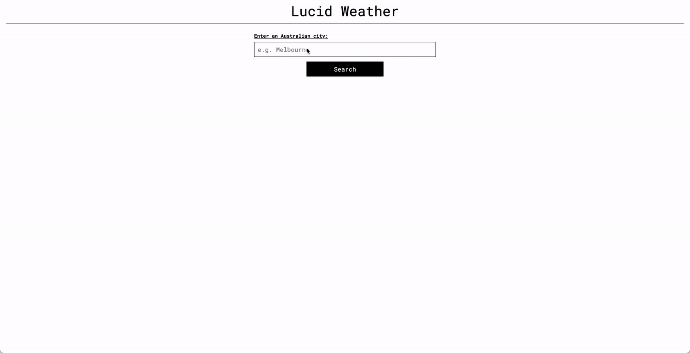

# Lucid Weather

An app to get weather forecast information for Australian cities.



## Description

Lucid Weather will show current and forecast information from the OpenWeather API for a particular city. The app's background colour will adjust dynamically according to the current weather conditions.

## Installation

To install this app locally:

1. Clone this repository

```
git clone https://github.com/kimbcheh/lucid-weather.git
```

2. Install packages

```
yarn install
```

3. Create a `.env` file inside the root directory
4. Add `REACT_APP_WEATHER_API_KEY=<insert your OpenWeather API key here>` to the `.env` file
5. Run the development server

```
yarn start
```

## Technology

This app is built using React and the following:

- [OpenWeather API](https://openweathermap.org/api)
- [create-react-app](https://create-react-app.dev/)
- [axios](https://axios-http.com/)
- [day.js](https://day.js.org/)
